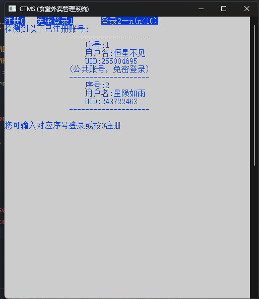
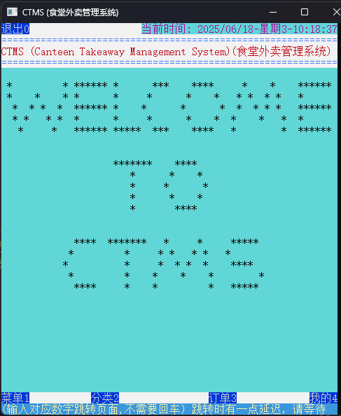
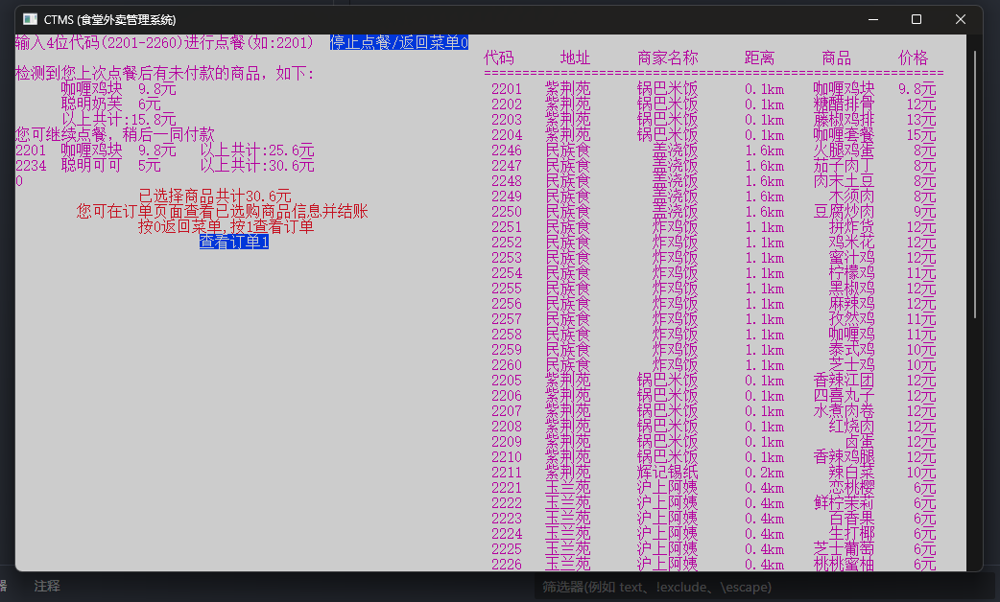
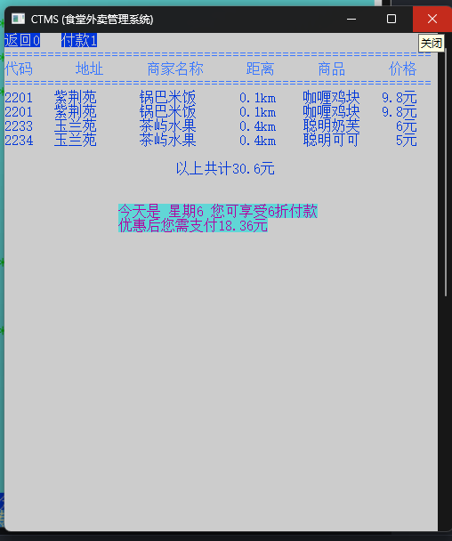
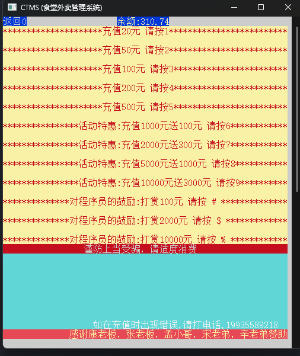
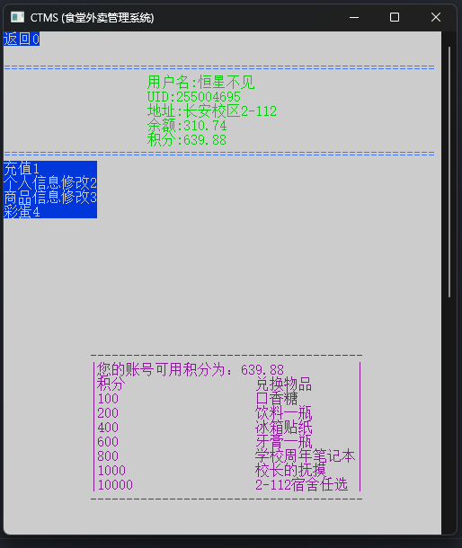

# C/C++控制台应用

### 食堂外面管理系统(CTMS)
0. 环境配置
    
        TODO
        请将编码解码方式设置为GBK或GB2312，并使用Windows控制台主机
        (而非windows终端)
        否则将乱码、界面显示不正确
1. 运行
        
        VSCode
        可使用.vscode文件夹下的配置文件launch.json与tasks.json编译运行
        
2. 运行效果图

